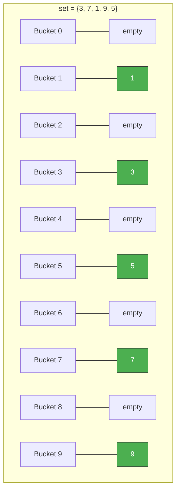
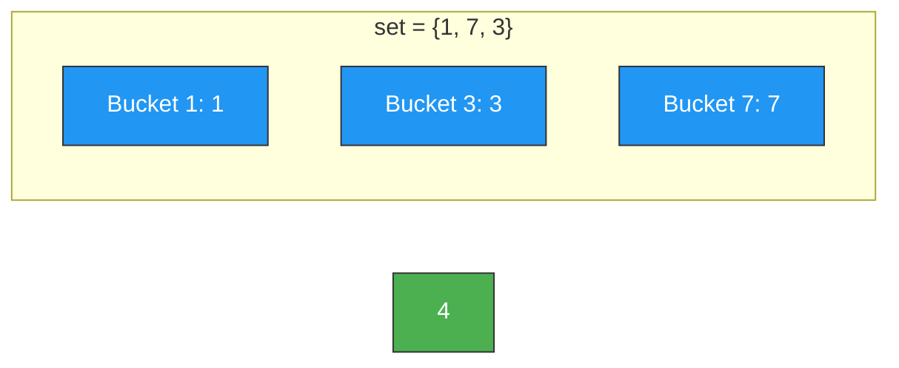
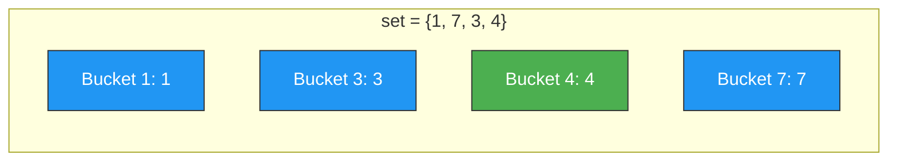
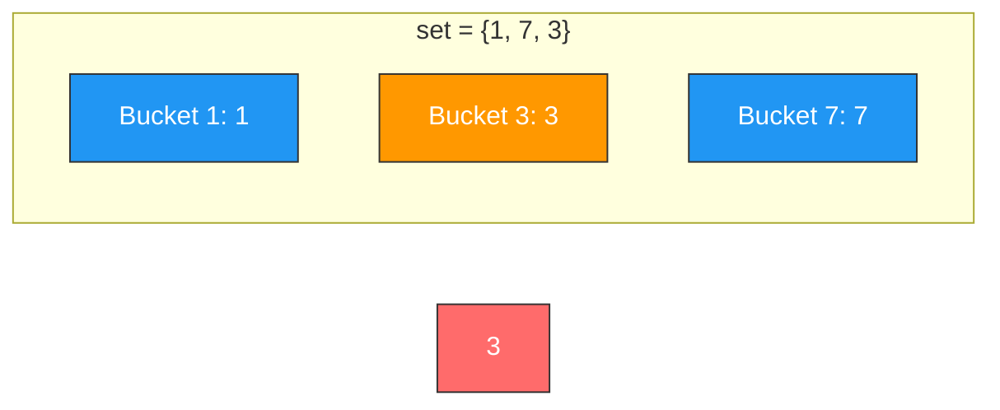
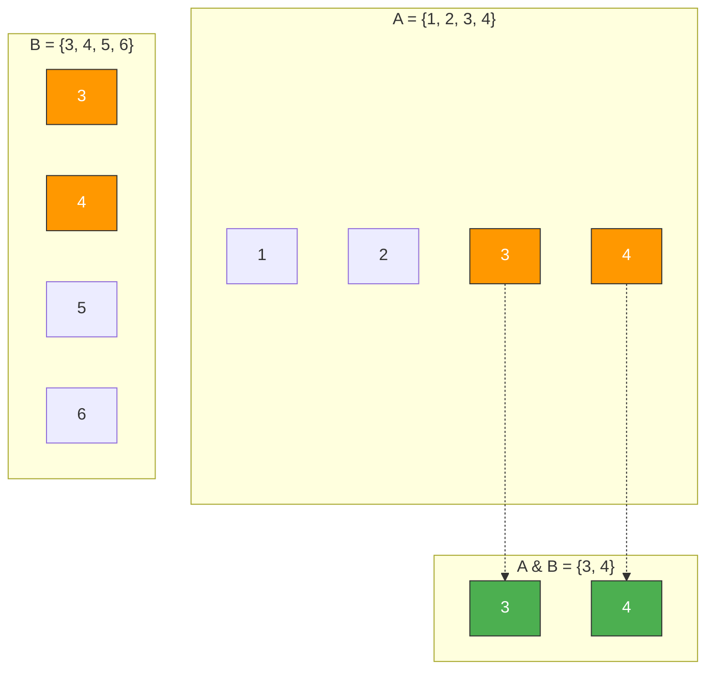

# DSA Mastery — SPEC v3 (Kiro IDE)

> **Philosophy:** Diagram first. Code second. Text last. Every data structure
> and algorithm is understood visually, then reinforced with working Python
> code. No walls of text. No explanation longer than 3 sentences.

---

## Core Rules for Content Generation

| Rule                       | Detail                                                         |
| -------------------------- | -------------------------------------------------------------- |
| **Diagram First**          | Every concept opens with a Mermaid diagram, never text         |
| **3-Sentence Max**         | No explanation block exceeds 3 sentences                       |
| **Code Is Mandatory**      | Every topic has a working `.py` file with type hints and tests |
| **Step-by-Step**           | Every operation → numbered steps + before/after diagrams       |
| **Python Is Primary**      | All code in Python 3.12+, using idiomatic Python patterns      |
| **Built-ins First**        | Always show Python's built-in way before custom implementation |

---

## Project Identity

| Field            | Value                                                      |
| ---------------- | ---------------------------------------------------------- |
| **Repo Name**    | `dsa-mastery`                                              |
| **Language**     | Python 3.12+ (primary and only)                            |
| **Audience**     | Learners + interview preppers + contributors               |
| **Rendering**    | GitHub-native Mermaid (no external images)                 |
| **Writing Style**| Minimal. Visual. Code-heavy. No filler.                    |

---

## Complete Data Structures Coverage

> Nothing is optional. Every structure below gets its own folder, README.md
> with Mermaid diagrams, AND a working Python implementation file.

### Category A — Python Built-in Data Structures

These are what Python gives you out of the box. Learners must master these
first since interviews expect fluency with them.

| #  | Data Structure     | Python Type         | Key Idea                                          |
| -- | ------------------ | ------------------- | ------------------------------------------------- |
| 01 | Lists              | `list`              | Dynamic array, O(1) append, O(1) access by index  |
| 02 | Tuples             | `tuple`             | Immutable list, hashable, used as dict keys        |
| 03 | Strings            | `str`               | Immutable character sequence, rich built-in methods|
| 04 | Sets               | `set`               | Unordered unique elements, O(1) add/remove/lookup  |
| 05 | Frozensets         | `frozenset`         | Immutable set, hashable, usable as dict key        |
| 06 | Dictionaries       | `dict`              | Key-value hash map, O(1) average lookup            |
| 07 | Booleans & None    | `bool`, `None`      | Truthy/falsy rules matter in DSA conditionals      |

### Category B — Python `collections` Module

These are Python's power tools. Interviewers expect you to reach for these
instead of reinventing the wheel.

| #  | Data Structure     | Python Type              | Key Idea                                      |
| -- | ------------------ | ------------------------ | --------------------------------------------- |
| 08 | Deque              | `collections.deque`      | Double-ended queue, O(1) append/pop both ends  |
| 09 | Counter            | `collections.Counter`    | Frequency map, most_common(), subtract()       |
| 10 | DefaultDict        | `collections.defaultdict`| Dict with auto-initialized default values      |
| 11 | OrderedDict        | `collections.OrderedDict`| Dict that remembers insertion order            |
| 12 | NamedTuple         | `collections.namedtuple` | Lightweight immutable object with named fields |

### Category C — Python `heapq` and `bisect` Modules

| #  | Data Structure     | Python Module     | Key Idea                                         |
| -- | ------------------ | ----------------- | ------------------------------------------------ |
| 13 | Min-Heap           | `heapq`           | Priority queue, O(log n) push/pop                |
| 14 | Sorted Containers  | `bisect`          | Binary search on sorted lists, O(log n) search   |

### Category D — Classical Data Structures (Build From Scratch)

These are the CS fundamentals. Learn the theory, build them yourself, then
use Python's built-ins in interviews.

| #  | Data Structure              | Key Idea                                                |
| -- | --------------------------- | ------------------------------------------------------- |
| 15 | Arrays (Static concept)     | Contiguous memory, fixed size (Python list is dynamic)   |
| 16 | Singly Linked List          | Nodes with `value` + `next` pointer                     |
| 17 | Doubly Linked List          | Nodes with `value` + `next` + `prev` pointers           |
| 18 | Circular Linked List        | Tail points back to head                                |
| 19 | Stack                       | LIFO — Python `list` or `deque` as backing store        |
| 20 | Queue                       | FIFO — Python `deque` as backing store                  |
| 21 | Circular Queue              | Fixed-size queue that wraps around                      |
| 22 | Priority Queue              | Heap-backed queue, Python `heapq` or `queue.PriorityQueue`|
| 23 | Hash Table (Custom)         | Build your own with chaining/open addressing            |
| 24 | Hash Set (Custom)           | Hash table storing only keys, no values                 |
| 25 | Binary Tree                 | Each node has at most 2 children                        |
| 26 | Binary Search Tree (BST)    | Left < Parent < Right                                   |
| 27 | AVL Tree                    | Self-balancing BST with rotations                       |
| 28 | Red-Black Tree (Conceptual) | Self-balancing BST (Python's `sorted containers` use it)|
| 29 | Trie (Prefix Tree)          | Tree of characters for prefix-based lookups             |
| 30 | Suffix Tree / Array         | All suffixes indexed for pattern matching               |
| 31 | Min-Heap (Custom)           | Build from scratch to understand heapify                |
| 32 | Max-Heap (Custom)           | Negate values or build custom comparator                |
| 33 | Graph (Adjacency List)      | Dict of lists — most common representation              |
| 34 | Graph (Adjacency Matrix)    | 2D list — good for dense graphs                         |
| 35 | Graph (Edge List)           | List of (u, v, weight) tuples                           |
| 36 | Union-Find (Disjoint Set)   | Track connected components, path compression + rank     |
| 37 | Segment Tree                | Range queries + point updates in O(log n)               |
| 38 | Fenwick Tree (BIT)          | Prefix sums with O(log n) update                        |
| 39 | Monotonic Stack             | Stack maintaining increasing/decreasing order           |
| 40 | Monotonic Queue             | Deque maintaining order for sliding window              |
| 41 | LRU Cache                   | Hash map + doubly linked list, O(1) get/put             |
| 42 | LFU Cache                   | Frequency-based eviction, more complex than LRU         |
| 43 | Skip List                   | Probabilistic alternative to balanced BSTs              |
| 44 | Bloom Filter (Conceptual)   | Probabilistic set membership — no false negatives       |

---

## Folder Structure

```
dsa-mastery/
│
├── README.md
│
├── 01-foundations/
│   ├── big-o-notation/
│   │   ├── README.md
│   │   └── examples.py
│   ├── recursion/
│   │   ├── README.md
│   │   └── recursion.py
│   └── bit-manipulation/
│       ├── README.md
│       └── bit_tricks.py
│
├── 02-python-built-ins/
│   ├── 01-lists/
│   │   ├── README.md
│   │   └── lists.py
│   ├── 02-tuples/
│   │   ├── README.md
│   │   └── tuples.py
│   ├── 03-strings/
│   │   ├── README.md
│   │   └── strings.py
│   ├── 04-sets/
│   │   ├── README.md
│   │   └── sets.py
│   ├── 05-frozensets/
│   │   ├── README.md
│   │   └── frozensets.py
│   ├── 06-dictionaries/
│   │   ├── README.md
│   │   └── dicts.py
│   └── 07-booleans-and-none/
│       ├── README.md
│       └── truthy_falsy.py
│
├── 03-python-collections/
│   ├── 01-deque/
│   │   ├── README.md
│   │   └── deque_usage.py
│   ├── 02-counter/
│   │   ├── README.md
│   │   └── counter_usage.py
│   ├── 03-defaultdict/
│   │   ├── README.md
│   │   └── defaultdict_usage.py
│   ├── 04-ordereddict/
│   │   ├── README.md
│   │   └── ordereddict_usage.py
│   └── 05-namedtuple/
│       ├── README.md
│       └── namedtuple_usage.py
│
├── 04-heapq-and-bisect/
│   ├── 01-heapq/
│   │   ├── README.md
│   │   └── heapq_usage.py
│   └── 02-bisect/
│       ├── README.md
│       └── bisect_usage.py
│
├── 05-data-structures/
│   ├── 01-arrays/
│   │   ├── README.md
│   │   └── arrays.py
│   ├── 02-linked-lists/
│   │   ├── README.md
│   │   ├── singly_linked_list.py
│   │   ├── doubly_linked_list.py
│   │   └── circular_linked_list.py
│   ├── 03-stacks/
│   │   ├── README.md
│   │   └── stack.py
│   ├── 04-queues/
│   │   ├── README.md
│   │   ├── queue.py
│   │   ├── circular_queue.py
│   │   └── priority_queue.py
│   ├── 05-hash-tables/
│   │   ├── README.md
│   │   ├── hash_table_chaining.py
│   │   ├── hash_table_open_addressing.py
│   │   └── hash_set.py
│   ├── 06-trees/
│   │   ├── binary-tree/
│   │   │   ├── README.md
│   │   │   └── binary_tree.py
│   │   ├── binary-search-tree/
│   │   │   ├── README.md
│   │   │   └── bst.py
│   │   ├── avl-tree/
│   │   │   ├── README.md
│   │   │   └── avl.py
│   │   └── red-black-tree/
│   │       └── README.md              # Conceptual only
│   ├── 07-tries/
│   │   ├── README.md
│   │   └── trie.py
│   ├── 08-heaps/
│   │   ├── README.md
│   │   ├── min_heap.py
│   │   └── max_heap.py
│   ├── 09-graphs/
│   │   ├── README.md
│   │   ├── adjacency_list.py
│   │   ├── adjacency_matrix.py
│   │   └── edge_list.py
│   ├── 10-union-find/
│   │   ├── README.md
│   │   └── union_find.py
│   ├── 11-segment-tree/
│   │   ├── README.md
│   │   └── segment_tree.py
│   ├── 12-fenwick-tree/
│   │   ├── README.md
│   │   └── fenwick_tree.py
│   ├── 13-monotonic-stack/
│   │   ├── README.md
│   │   └── monotonic_stack.py
│   ├── 14-monotonic-queue/
│   │   ├── README.md
│   │   └── monotonic_queue.py
│   ├── 15-lru-cache/
│   │   ├── README.md
│   │   └── lru_cache.py
│   ├── 16-lfu-cache/
│   │   ├── README.md
│   │   └── lfu_cache.py
│   ├── 17-skip-list/
│   │   ├── README.md
│   │   └── skip_list.py
│   └── 18-bloom-filter/
│       └── README.md                  # Conceptual only
│
├── 06-algorithms/
│   ├── sorting/
│   │   ├── README.md
│   │   ├── bubble_sort.py
│   │   ├── selection_sort.py
│   │   ├── insertion_sort.py
│   │   ├── merge_sort.py
│   │   ├── quick_sort.py
│   │   ├── heap_sort.py
│   │   ├── counting_sort.py
│   │   └── radix_sort.py
│   ├── searching/
│   │   ├── README.md
│   │   ├── linear_search.py
│   │   └── binary_search.py
│   ├── two-pointers/
│   │   ├── README.md
│   │   └── two_pointers.py
│   ├── sliding-window/
│   │   ├── README.md
│   │   └── sliding_window.py
│   ├── divide-and-conquer/
│   │   ├── README.md
│   │   └── examples.py
│   ├── greedy/
│   │   ├── README.md
│   │   └── examples.py
│   ├── dynamic-programming/
│   │   ├── README.md
│   │   └── patterns/
│   ├── backtracking/
│   │   ├── README.md
│   │   └── backtracking.py
│   └── graph-algorithms/
│       ├── README.md
│       ├── bfs.py
│       ├── dfs.py
│       ├── dijkstra.py
│       ├── bellman_ford.py
│       ├── topological_sort.py
│       ├── kruskal.py
│       └── prim.py
│
├── 07-patterns/
│   └── README.md
│
├── 08-problems/
│   ├── README.md
│   └── leetcode/
│
├── cheat-sheets/
│   ├── complexity-cheat-sheet.md
│   └── python-dsa-tricks.md
│
└── templates/
    ├── topic-template.md
    ├── problem-template.md
    └── code-template.py
```

---

## Topic README Template

Every topic folder follows this exact structure.

````markdown
# [Topic Name]

## What Is It?

> [ONE sentence. Max 20 words.]

## Structure

```mermaid
[Diagram of the data structure with sample data]
```

> [1–2 sentences: what the diagram shows and the core invariant.]

## Real-World Analogy

> [One sentence analogy.]

## Python Built-in Way

```python
# How Python does this natively (if applicable)
# Show the 3-5 most important operations
```

> [1 sentence: when to use the built-in vs building your own.]

## Operations at a Glance

| Operation      | Time     | Space | Description               |
| -------------- | -------- | ----- | ------------------------- |
| [operation]    | O(?)     | O(?)  | [one line]                |

## Step-by-Step: [Operation Name]

**Before:**

```mermaid
[State BEFORE the operation — use color for the element being affected]
```

**Step 1:** [One sentence]

**Step 2:** [One sentence]

**Step 3:** [One sentence]

**After:**

```mermaid
[State AFTER the operation — use color for what changed]
```

> Repeat for each key operation (Insert, Delete, Search, etc.)

## When to Use It

| Use When                        | Don't Use When                    |
| ------------------------------- | --------------------------------- |
| [signal]                        | [anti-pattern]                    |

## Edge Cases

- [case 1]
- [case 2]
- [case 3]

## Implementation

→ See [`filename.py`](./filename.py)

## Practice Problems

| Problem            | Difficulty | Key Insight              |
| ------------------ | ---------- | ------------------------ |
| [name]             | Easy       | [one line]               |
````

---

## Code File Template

Every `.py` file follows this structure.

```python
"""
Topic:      [Data Structure / Algorithm Name]
Category:   [Built-in / Collections / Classical DS / Algorithm]
Python:     3.12+

Complexity:
    [Operation 1]: Time O(?) | Space O(?)
    [Operation 2]: Time O(?) | Space O(?)
"""

from __future__ import annotations
from typing import Any


# ──────────────────────────────────────────────
# Python Built-in Way (if applicable)
# ──────────────────────────────────────────────

def builtin_example() -> None:
    """Show how Python handles this natively."""
    # Example using Python's built-in type
    pass


# ──────────────────────────────────────────────
# Custom Implementation
# ──────────────────────────────────────────────

class DataStructureName:
    """
    Brief description.

    Operations:
        method_name(): O(?) time, O(?) space — what it does
    """

    def __init__(self) -> None:
        pass

    def __repr__(self) -> str:
        pass

    def __len__(self) -> int:
        pass


# ──────────────────────────────────────────────
# Tests
# ──────────────────────────────────────────────

if __name__ == "__main__":
    # --- Built-in usage ---
    print("=== Python Built-in ===")
    builtin_example()

    # --- Custom implementation ---
    print("\n=== Custom Implementation ===")
    ds = DataStructureName()

    # Test 1: [describe]
    assert True, "Test 1 failed"

    # Test 2: [describe]
    assert True, "Test 2 failed"

    # Test 3: Edge case — [describe]
    assert True, "Test 3 failed"

    print("✅ All tests passed!")
```

---

## Fully Worked Example — Sets

This shows exactly what Kiro should produce for EVERY topic.

### README.md

````markdown
# Sets

## What Is It?

> An unordered collection of unique elements with O(1) average lookup, add, and remove.

## Structure



> A set is backed by a hash table that stores only keys (no values). Elements
> are placed in buckets based on their hash. Duplicates are impossible.

## Real-World Analogy

> A guest list at a party — you can quickly check if someone's invited, and
> no name appears twice.

## Python Built-in Way

```python
# Creating
fruits = {"apple", "banana", "cherry"}
empty = set()                          # NOT {} — that's a dict

# Add / Remove — O(1)
fruits.add("mango")
fruits.discard("banana")               # No error if missing
fruits.remove("cherry")                # KeyError if missing

# Lookup — O(1)
print("apple" in fruits)               # True

# Set Operations — O(len(s1) + len(s2))
a = {1, 2, 3, 4}
b = {3, 4, 5, 6}
print(a | b)       # Union:        {1, 2, 3, 4, 5, 6}
print(a & b)       # Intersection: {3, 4}
print(a - b)       # Difference:   {1, 2}
print(a ^ b)       # Symmetric:    {1, 2, 5, 6}

# From list (deduplicate) — O(n)
nums = [1, 2, 2, 3, 3, 3]
unique = set(nums)                     # {1, 2, 3}

# Set comprehension
evens = {x for x in range(10) if x % 2 == 0}
```

> Python's `set` covers 99% of interview use cases. Build a custom hash set
> only to understand how hashing works internally.

## Operations at a Glance

| Operation              | Time (Avg) | Time (Worst) | Space | Description                    |
| ---------------------- | ---------- | ------------ | ----- | ------------------------------ |
| `add(x)`               | O(1)       | O(n)         | O(1)  | Insert element                 |
| `remove(x)`            | O(1)       | O(n)         | O(1)  | Remove, KeyError if missing    |
| `discard(x)`           | O(1)       | O(n)         | O(1)  | Remove, no error if missing    |
| `x in s`               | O(1)       | O(n)         | O(1)  | Membership check               |
| `union (a \| b)`       | O(m+n)     | O(m+n)       | O(m+n)| All elements from both         |
| `intersection (a & b)` | O(min(m,n))| O(m*n)       | O(min) | Common elements                |
| `difference (a - b)`   | O(m)       | O(m*n)       | O(m)  | In a but not in b              |
| `len(s)`               | O(1)       | O(1)         | O(1)  | Number of elements             |

> Worst case O(n) happens only with extreme hash collisions — rare in practice.

## Step-by-Step: Add Element

**Before:** Add `4` to `{1, 7, 3}`.



**Step 1:** Compute `hash(4)` → determines bucket (e.g., bucket 4).

**Step 2:** Check if bucket 4 already contains `4` → it doesn't.

**Step 3:** Place `4` in bucket 4.

**After:**



## Step-by-Step: Duplicate Rejected

**Before:** Add `3` to `{1, 7, 3}`.



**Step 1:** Compute `hash(3)` → bucket 3.

**Step 2:** Bucket 3 already contains `3` → **duplicate detected**.

**Step 3:** Do nothing. Set is unchanged.

## Step-by-Step: Set Intersection



**Step 1:** Iterate over the smaller set.

**Step 2:** For each element, check if it exists in the larger set.

**Step 3:** If yes, add to result.

## When to Use It

| Use When                                  | Don't Use When                         |
| ----------------------------------------- | -------------------------------------- |
| Need O(1) membership checks               | Order matters                          |
| Need to remove duplicates from a list     | Need to store key-value pairs (→ dict) |
| Need union / intersection / difference    | Need to access elements by index       |
| Tracking "seen" elements in traversal     | Elements are unhashable (lists, dicts) |

## Edge Cases

- Empty set: `set()` not `{}` (that creates a dict)
- Unhashable types: `{[1,2]}` raises `TypeError` — use `frozenset` or tuples
- Single element: `{5}` is a set, `(5)` is NOT a tuple (need `(5,)`)
- Set of sets: not possible directly — use `frozenset` as elements
- `None` is hashable: `{None, 1, 2}` is valid

## Implementation

→ See [`sets.py`](./sets.py) for built-in usage and [`hash_set.py`](../05-hash-tables/hash_set.py) for custom implementation.

## Practice Problems

| Problem                              | Difficulty | Key Insight                                |
| ------------------------------------ | ---------- | ------------------------------------------ |
| Contains Duplicate                   | Easy       | `len(nums) != len(set(nums))`              |
| Intersection of Two Arrays          | Easy       | `set(a) & set(b)`                          |
| Happy Number                         | Easy       | Use set to detect cycle in seen numbers    |
| Longest Consecutive Sequence         | Medium     | Set lookup to find sequence starts         |
| Set Mismatch                         | Easy       | Expected set vs actual set difference      |
````

### sets.py

```python
"""
Topic:      Sets
Category:   Python Built-in Data Structure
Python:     3.12+

Complexity:
    add / remove / lookup: O(1) average, O(n) worst
    union / intersection:  O(m + n)
"""

from __future__ import annotations


# ──────────────────────────────────────────────
# Python Built-in: set
# ──────────────────────────────────────────────

def builtin_set_demo() -> None:
    """Core set operations every Python developer must know."""

    # --- Creation ---
    empty: set[int] = set()
    from_list: set[int] = {1, 2, 3, 2, 1}      # {1, 2, 3}
    from_range: set[int] = {x for x in range(5)} # {0, 1, 2, 3, 4}
    print(f"from_list:  {from_list}")
    print(f"from_range: {from_range}")

    # --- Add / Remove ---
    s: set[str] = {"a", "b", "c"}
    s.add("d")                          # {"a", "b", "c", "d"}
    s.discard("b")                      # {"a", "c", "d"} — safe
    s.remove("c")                       # {"a", "d"} — raises KeyError if missing
    popped = s.pop()                    # removes arbitrary element
    print(f"after mutations: {s}, popped: {popped}")

    # --- Membership ---
    fruits: set[str] = {"apple", "banana", "cherry"}
    print(f"'apple' in fruits: {'apple' in fruits}")    # True  — O(1)
    print(f"'mango' in fruits: {'mango' in fruits}")    # False — O(1)

    # --- Set Algebra ---
    a: set[int] = {1, 2, 3, 4}
    b: set[int] = {3, 4, 5, 6}

    print(f"union:        {a | b}")      # {1, 2, 3, 4, 5, 6}
    print(f"intersection: {a & b}")      # {3, 4}
    print(f"difference:   {a - b}")      # {1, 2}
    print(f"sym_diff:     {a ^ b}")      # {1, 2, 5, 6}
    print(f"is_subset:    {a <= b}")      # False
    print(f"is_superset:  {a >= b}")      # False

    # --- Deduplicate a List ---
    nums: list[int] = [4, 2, 7, 2, 4, 9, 7]
    unique: list[int] = list(set(nums))
    print(f"deduplicated: {unique}")

    # --- Frozenset (immutable, hashable) ---
    fs: frozenset[int] = frozenset([1, 2, 3])
    set_of_sets: set[frozenset[int]] = {
        frozenset([1, 2]),
        frozenset([3, 4]),
    }
    print(f"frozenset:    {fs}")
    print(f"set of sets:  {set_of_sets}")


# ──────────────────────────────────────────────
# Custom Implementation: HashSet
# ──────────────────────────────────────────────

class HashSet:
    """
    Custom hash set using separate chaining.

    Operations:
        add(key):      O(1) avg — insert element
        remove(key):   O(1) avg — remove element
        contains(key): O(1) avg — check membership
        __len__():     O(1)     — number of elements
    """

    def __init__(self, capacity: int = 16, load_factor: float = 0.75) -> None:
        self._capacity: int = capacity
        self._load_factor: float = load_factor
        self._size: int = 0
        self._buckets: list[list[int]] = [[] for _ in range(capacity)]

    def _hash(self, key: int) -> int:
        """Compute bucket index for given key."""
        return hash(key) % self._capacity

    def _resize(self) -> None:
        """Double capacity and rehash all elements."""
        old_buckets = self._buckets
        self._capacity *= 2
        self._buckets = [[] for _ in range(self._capacity)]
        self._size = 0
        for bucket in old_buckets:
            for key in bucket:
                self.add(key)

    def add(self, key: int) -> None:
        """Add element. O(1) average."""
        if self.contains(key):
            return
        if self._size / self._capacity >= self._load_factor:
            self._resize()
        idx = self._hash(key)
        self._buckets[idx].append(key)
        self._size += 1

    def remove(self, key: int) -> None:
        """Remove element. O(1) average. No error if missing."""
        idx = self._hash(key)
        bucket = self._buckets[idx]
        for i, k in enumerate(bucket):
            if k == key:
                bucket.pop(i)
                self._size -= 1
                return

    def contains(self, key: int) -> bool:
        """Check membership. O(1) average."""
        idx = self._hash(key)
        return key in self._buckets[idx]

    def __len__(self) -> int:
        return self._size

    def __repr__(self) -> str:
        elements = []
        for bucket in self._buckets:
            elements.extend(bucket)
        return f"HashSet({elements})"


# ──────────────────────────────────────────────
# Tests
# ──────────────────────────────────────────────

if __name__ == "__main__":
    print("=== Python Built-in Set ===")
    builtin_set_demo()

    print("\n=== Custom HashSet ===")
    hs = HashSet()

    # Test 1: Add and contains
    hs.add(5)
    hs.add(10)
    hs.add(15)
    assert hs.contains(5), "Test 1a failed"
    assert hs.contains(10), "Test 1b failed"
    assert not hs.contains(99), "Test 1c failed"
    print(f"After add 5, 10, 15: {hs}")

    # Test 2: Duplicate rejected
    hs.add(5)
    assert len(hs) == 3, "Test 2 failed — duplicate was added"
    print(f"After adding duplicate 5: len={len(hs)}")

    # Test 3: Remove
    hs.remove(10)
    assert not hs.contains(10), "Test 3a failed"
    assert len(hs) == 2, "Test 3b failed"
    print(f"After removing 10: {hs}")

    # Test 4: Remove non-existent (no error)
    hs.remove(999)
    assert len(hs) == 2, "Test 4 failed"

    # Test 5: Edge case — empty set
    empty_hs = HashSet()
    assert len(empty_hs) == 0, "Test 5a failed"
    assert not empty_hs.contains(1), "Test 5b failed"

    # Test 6: Resize triggers
    bulk_hs = HashSet(capacity=4)
    for i in range(20):
        bulk_hs.add(i)
    assert len(bulk_hs) == 20, "Test 6 failed"
    for i in range(20):
        assert bulk_hs.contains(i), f"Test 6 failed — missing {i}"
    print(f"Bulk insert 0-19: len={len(bulk_hs)}")

    print("\n✅ All tests passed!")
```

---

## Mermaid Diagram Standards

| Concept                        | Mermaid Type        | Color Convention                          |
| ------------------------------ | ------------------- | ----------------------------------------- |
| Structure layout               | `graph LR` or `TD`  | Blue `#2196F3` for existing elements      |
| Before/After operations        | `graph LR` or `TD`  | Green `#4CAF50` for new/inserted          |
| Deletion                       | `graph LR` or `TD`  | Red `#FF6B6B` for removed/target          |
| Highlighted / Active           | any                 | Orange `#FF9800` for focus element        |
| Algorithm flowchart            | `flowchart TD`      | Green for final result node               |
| State transitions              | `stateDiagram-v2`   | For DP state machines, FSMs               |
| Step-by-step process           | `sequenceDiagram`   | For interaction between components        |
| Topic taxonomy / overview      | `mindmap`           | For root README roadmap                   |
| Comparison                     | `graph TD`          | Side-by-side subgraphs                    |

### classDef Cheat Sheet

```
classDef existing fill:#2196F3,stroke:#333,color:#fff
classDef new      fill:#4CAF50,stroke:#333,color:#fff
classDef danger   fill:#FF6B6B,stroke:#333,color:#fff
classDef focus    fill:#FF9800,stroke:#333,color:#fff
classDef result   fill:#9C27B0,stroke:#333,color:#fff
classDef muted    fill:#9E9E9E,stroke:#333,color:#fff
```

---

## Kiro IDE Generation Prompt (Per Topic)

```
Generate the complete folder contents for [TOPIC_NAME] in my DSA repository.

Required files:
1. README.md — following the Topic README Template from SPEC v3
2. [topic].py — following the Code File Template from SPEC v3

STRICT RULES:
- Open README with Mermaid diagram, NOT text
- No explanation block exceeds 3 sentences
- Show Python built-in way FIRST, then custom implementation
- Every operation: before/after Mermaid diagrams + numbered steps
- Use classDef colors: blue=existing, green=new, red=deleted, orange=focus
- Complexity inline in operations table
- Code file must have: type hints, docstrings, builtin demo, custom class, tests
- Tests must include: normal case, edge case (empty), edge case (single element)
- "When to Use" is a 2-column table
- 3+ edge cases, 5+ practice problems with "Key Insight" column
- NO filler phrases

Topic: [TOPIC_NAME]
Category: [python-built-in / collections / heapq-bisect / classical-ds / algorithm]
```

---

## Quality Checklist (Per Topic)

- [ ] README opens with Mermaid diagram (not text)
- [ ] No text block exceeds 3 sentences
- [ ] Python built-in way shown before custom implementation
- [ ] Every operation has before/after Mermaid diagrams
- [ ] Steps are numbered, one sentence each
- [ ] Mermaid uses consistent classDef colors
- [ ] Complexity table is fully filled
- [ ] "When to Use" table has both columns
- [ ] 3+ edge cases listed
- [ ] 5+ practice problems with key insight
- [ ] `.py` file has type hints on every function
- [ ] `.py` file has docstrings on every class and method
- [ ] `.py` file shows built-in usage AND custom implementation
- [ ] `.py` file has `if __name__ == "__main__":` with passing assertions
- [ ] All Mermaid diagrams render correctly on GitHub