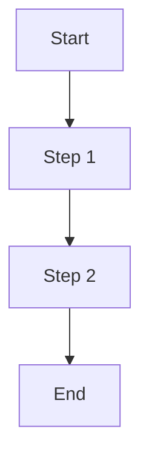
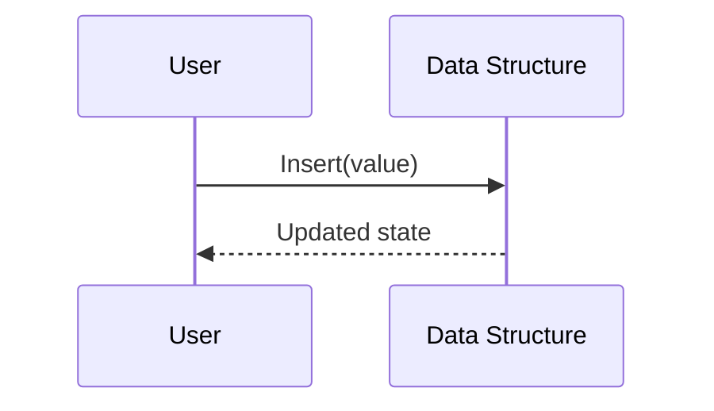
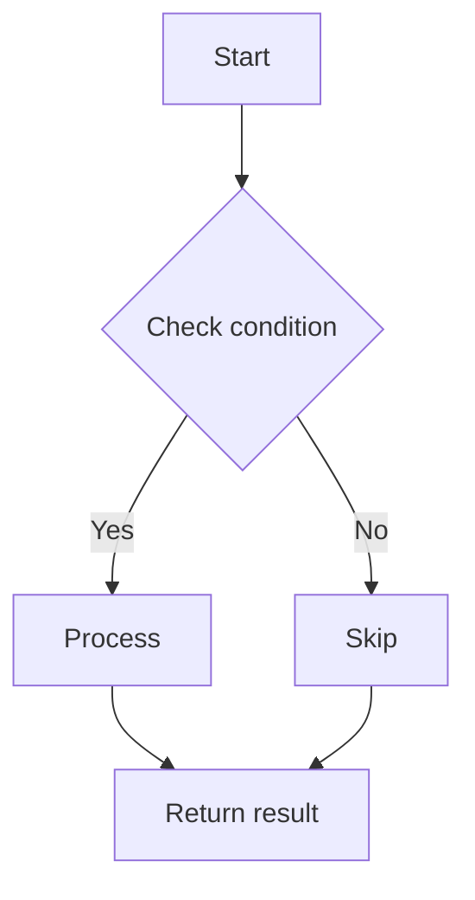
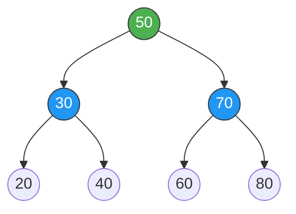
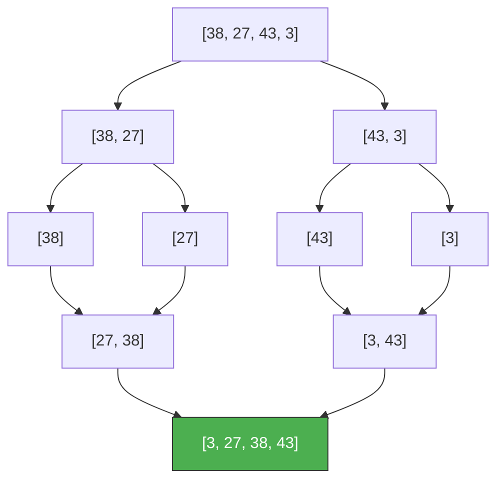
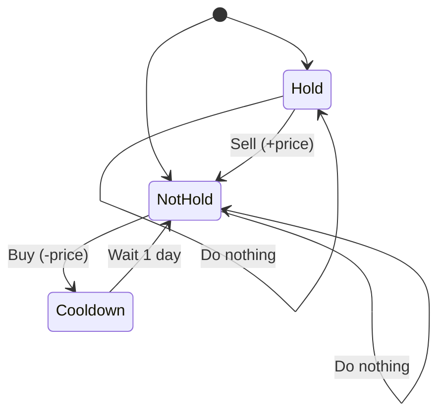
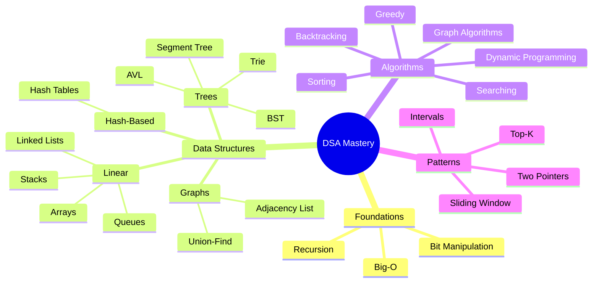

# 🧠 DSA Mastery Repository — SPEC-Driven Prompt for Kiro IDE

> **Goal:** Build a world-class, interview-ready Data Structures & Algorithms repository with rich Markdown documentation, GitHub-native Mermaid diagrams, clean code implementations, and structured problem-solving patterns — targeting FAANG / top-tier software engineering roles.

---

## 📋 SPEC: Repository Blueprint

### 1. Project Identity

| Field             | Value                                                                 |
| ----------------- | --------------------------------------------------------------------- |
| **Repo Name**     | `dsa-mastery`                                                         |
| **Language**      | Python 3.12+ (primary), with optional TypeScript/Java variants later  |
| **Target**        | Google, Meta, Amazon, Apple, Microsoft, and top startups               |
| **Audience**      | Self-study + public showcase on GitHub                                |
| **Rendering**     | All diagrams use **Mermaid** (GitHub-native, no external images)      |
| **Style**         | Clean, minimal, professional — no emojis in code, minimal in docs     |

---

### 2. Folder Architecture

```
dsa-mastery/
│
├── README.md                          # 🏠 Main index, roadmap, progress tracker
├── CONTRIBUTING.md                    # Contribution guidelines (for public repos)
├── LICENSE
│
├── foundations/
│   ├── big-o-notation/
│   │   └── README.md                 # Time & Space complexity deep-dive
│   ├── recursion/
│   │   └── README.md
│   └── bit-manipulation/
│       └── README.md
│
├── data-structures/
│   ├── arrays/
│   │   ├── README.md                 # Theory + Mermaid + Complexity Table
│   │   ├── dynamic_array.py
│   │   └── problems.md               # Curated problems list with difficulty tags
│   ├── strings/
│   ├── linked-lists/
│   │   ├── README.md
│   │   ├── singly_linked_list.py
│   │   ├── doubly_linked_list.py
│   │   └── problems.md
│   ├── stacks/
│   ├── queues/
│   ├── hash-tables/
│   ├── heaps/
│   ├── trees/
│   │   ├── binary-tree/
│   │   ├── binary-search-tree/
│   │   ├── avl-tree/
│   │   ├── segment-tree/
│   │   ├── fenwick-tree/
│   │   └── trie/
│   ├── graphs/
│   │   ├── README.md
│   │   ├── adjacency_list.py
│   │   ├── adjacency_matrix.py
│   │   └── problems.md
│   ├── union-find/
│   └── advanced/
│       ├── monotonic-stack/
│       ├── monotonic-queue/
│       └── lru-cache/
│
├── algorithms/
│   ├── sorting/
│   │   ├── README.md                 # Comparative analysis + Mermaid flowcharts
│   │   ├── bubble_sort.py
│   │   ├── selection_sort.py
│   │   ├── insertion_sort.py
│   │   ├── merge_sort.py
│   │   ├── quick_sort.py
│   │   ├── heap_sort.py
│   │   ├── counting_sort.py
│   │   ├── radix_sort.py
│   │   └── problems.md
│   ├── searching/
│   │   ├── binary_search.py
│   │   └── README.md
│   ├── two-pointers/
│   ├── sliding-window/
│   ├── divide-and-conquer/
│   ├── greedy/
│   ├── dynamic-programming/
│   │   ├── README.md                 # Pattern taxonomy (Knapsack, LCS, LIS, etc.)
│   │   ├── patterns/
│   │   │   ├── knapsack.md
│   │   │   ├── longest-common-subsequence.md
│   │   │   ├── interval-scheduling.md
│   │   │   ├── matrix-chain.md
│   │   │   ├── state-machine.md
│   │   │   └── bitmask-dp.md
│   │   └── problems.md
│   ├── backtracking/
│   ├── graph-algorithms/
│   │   ├── bfs.py
│   │   ├── dfs.py
│   │   ├── dijkstra.py
│   │   ├── bellman_ford.py
│   │   ├── floyd_warshall.py
│   │   ├── topological_sort.py
│   │   ├── kruskal.py
│   │   ├── prim.py
│   │   └── README.md
│   └── advanced/
│       ├── kmp.py
│       ├── rabin_karp.py
│       └── README.md
│
├── patterns/                          # Interview pattern playbook
│   ├── README.md                      # Master index of all patterns
│   ├── fast-and-slow-pointers.md
│   ├── merge-intervals.md
│   ├── top-k-elements.md
│   ├── binary-search-variations.md
│   ├── tree-bfs-dfs.md
│   ├── subsets-permutations.md
│   ├── modified-binary-search.md
│   ├── two-heaps.md
│   ├── k-way-merge.md
│   └── monotonic-stack-patterns.md
│
├── problems/                          # Solved problems organized by source
│   ├── README.md                      # Progress tracker table
│   ├── leetcode/
│   │   ├── 0001-two-sum/
│   │   │   ├── README.md             # Problem statement, approach, complexity
│   │   │   └── solution.py
│   │   ├── 0003-longest-substring/
│   │   └── ...
│   ├── neetcode-150/                  # Curated list tracking
│   │   └── README.md
│   └── company-tagged/
│       ├── google/
│       ├── meta/
│       ├── amazon/
│       └── README.md
│
├── cheat-sheets/
│   ├── complexity-cheat-sheet.md      # Master Big-O reference
│   ├── python-tricks-for-dsa.md       # Language-specific tips
│   ├── common-mistakes.md
│   └── interview-tips.md
│
└── templates/
    ├── topic-readme-template.md       # Reusable template for each topic
    ├── problem-readme-template.md     # Reusable template for each problem
    └── code-template.py               # Boilerplate with docstrings
```

---

### 3. README.md Templates (The Core SPEC)

---

#### 3A. Topic README Template (`templates/topic-readme-template.md`)

Every topic folder (e.g., `linked-lists/`, `sorting/`) **must** contain a `README.md` following this exact structure:

````markdown
# [Topic Name]

## What Is It?

A concise 2–3 sentence definition. Explain what problem this data structure or
algorithm solves and **why it exists**. Mention real-world analogies if helpful.

## Visual Representation



> Add multiple diagrams if the topic benefits from it (e.g., before/after
> an insertion, step-by-step execution of an algorithm).

## Core Operations & Complexity

| Operation        | Time (Best) | Time (Average) | Time (Worst) | Space (Worst) |
| ---------------- | ----------- | -------------- | ------------ | ------------- |
| Access           | O(1)        | O(n)           | O(n)         | O(n)          |
| Search           | O(1)        | O(n)           | O(n)         | —             |
| Insertion        | O(1)        | O(1)           | O(n)         | —             |
| Deletion         | O(1)        | O(1)           | O(n)         | —             |

## How It Works (Step-by-Step)

Break the algorithm or data structure into numbered steps.
Use Mermaid `sequenceDiagram` or `flowchart` to illustrate the process.



## When to Use It (Interview Intuition)

- **Use when:** [specific signal in the problem statement]
- **Don't use when:** [specific anti-pattern]
- **Common interview signals:** [keywords that hint at this topic]
- **Pairs well with:** [complementary data structures or techniques]

## Key Patterns & Variations

List the most common variations or sub-types you'll see in interviews.
For each, provide a one-liner on when it applies.

## Common Pitfalls & Edge Cases

- Edge case 1: Empty input
- Edge case 2: Single element
- Edge case 3: Duplicates
- Pitfall: Off-by-one errors in [specific operation]

## Implementation

→ See [`implementation_file.py`](./implementation_file.py)

## Must-Solve Problems

| #    | Problem                  | Difficulty | Pattern          | Link       |
| ---- | ------------------------ | ---------- | ---------------- | ---------- |
| 1    | [Problem Name]           | Easy       | [Pattern]        | [LeetCode] |
| 2    | [Problem Name]           | Medium     | [Pattern]        | [LeetCode] |
| 3    | [Problem Name]           | Hard       | [Pattern]        | [LeetCode] |

## References & Further Reading

- [Link to authoritative source]
- [Link to best video explanation]
````

---

#### 3B. Problem README Template (`templates/problem-readme-template.md`)

Every problem folder (e.g., `0001-two-sum/`) **must** contain a `README.md`:

````markdown
# [Problem Number] — [Problem Name]

| Detail         | Value                              |
| -------------- | ---------------------------------- |
| **Source**      | LeetCode / GFG / Codeforces       |
| **Difficulty**  | Easy / Medium / Hard               |
| **Topics**      | Array, Hash Map                    |
| **Companies**   | Google, Amazon, Meta               |
| **Pattern**     | Hash Map Lookup                    |
| **Link**        | [Problem URL]                      |

## Problem Statement

Restate the problem **concisely** in your own words. Include:
- Input format and constraints
- Output format
- Example(s)

## Approach 1: [Name] (e.g., Brute Force)

### Intuition

Why does this approach work? What is the core idea?

### Algorithm



### Complexity

| Metric | Value | Explanation                 |
| ------ | ----- | --------------------------- |
| Time   | O(n²) | Nested loop over all pairs  |
| Space  | O(1)  | No extra space used         |

## Approach 2: [Name] (e.g., Optimal — Hash Map)

### Intuition

What insight transforms the brute force into something better?

### Algorithm

(Mermaid diagram for optimal approach)

### Complexity

| Metric | Value | Explanation                     |
| ------ | ----- | ------------------------------- |
| Time   | O(n)  | Single pass with hash map       |
| Space  | O(n)  | Hash map stores up to n entries |

## Key Takeaways

- What pattern did this problem teach?
- What similar problems use the same technique?
- Any tricky edge case worth remembering?
````

---

#### 3C. Code File Template (`templates/code-template.py`)

```python
"""
Topic/Problem: [Name]
Category:      [Data Structure / Algorithm / Problem]
Complexity:    Time O(?)  |  Space O(?)
Author:        [Your Name]
Date:          [Date]

Description:
    [Brief description of what this code implements]

References:
    - [Link to problem or theory]
"""

from typing import List, Optional


class Solution:
    """
    Approach: [Name of approach]

    Intuition:
        [1-2 sentences on why this works]

    Algorithm:
        1. [Step 1]
        2. [Step 2]
        3. [Step 3]

    Complexity:
        Time:  O(n) — [reason]
        Space: O(n) — [reason]
    """

    def solve(self, nums: List[int], target: int) -> List[int]:
        # Implementation here
        pass


# ──────────────────────────────────────────────
# Tests
# ──────────────────────────────────────────────
if __name__ == "__main__":
    s = Solution()

    # Test Case 1: Normal case
    assert s.solve([2, 7, 11, 15], 9) == [0, 1], "Test 1 Failed"

    # Test Case 2: Edge case
    assert s.solve([3, 3], 6) == [0, 1], "Test 2 Failed"

    print("✅ All tests passed!")
```

---

### 4. Mermaid Diagram Standards

Use these diagram types consistently across the repo:

| Use Case                          | Mermaid Type         | Example Context                    |
| --------------------------------- | -------------------- | ---------------------------------- |
| Data structure layout             | `graph LR` or `TD`   | Linked list, tree, graph           |
| Algorithm step-by-step flow       | `flowchart TD`       | Sorting, searching logic           |
| State transitions                 | `stateDiagram-v2`    | DFA, DP state machines             |
| Process interaction               | `sequenceDiagram`    | How operations modify a structure  |
| Comparison / taxonomy             | `mindmap`            | Sorting algorithm family tree      |
| Timeline of operations            | `gantt`              | Algorithm execution timeline       |

**Example — Binary Search Tree:**

````markdown

````

**Example — Merge Sort Flowchart:**

````markdown

````

**Example — DP State Machine:**

````markdown

````

---

### 5. Content Depth Requirements (Per Topic)

Each topic must be written as if you're explaining it to a **smart peer who has never seen it before**, while also being a **quick-reference cheat sheet** for yourself the night before an interview.

| Section                    | Depth                                                                 |
| -------------------------- | --------------------------------------------------------------------- |
| **Definition**             | 2–3 sentences. No fluff.                                              |
| **Visual**                 | At least 1 Mermaid diagram. 2+ for complex topics.                    |
| **Complexity Table**       | Every operation. Best / Average / Worst / Space.                      |
| **Step-by-Step**           | Numbered. With diagram. Trace through a small example.                |
| **Interview Intuition**    | When to recognize it. Signal words. What it pairs with.               |
| **Patterns & Variations**  | Sub-types. e.g., for Binary Search: classic, on-answer, rotated array |
| **Edge Cases**             | At least 3–5 edge cases with brief explanations.                      |
| **Must-Solve Problems**    | 5–10 curated problems with difficulty + pattern tags.                  |
| **Code Implementation**    | Clean Python. Type hints. Docstrings. Test cases.                     |

---

### 6. Topic Coverage Checklist

#### Foundations
- [ ] Big-O Notation (Time & Space, Amortized, Best/Worst/Average)
- [ ] Recursion & Call Stack
- [ ] Bit Manipulation

#### Data Structures
- [ ] Arrays & Dynamic Arrays
- [ ] Strings (Immutability, Encoding)
- [ ] Linked Lists (Singly, Doubly, Circular)
- [ ] Stacks
- [ ] Queues (Queue, Deque, Priority Queue)
- [ ] Hash Tables (Collision handling, Load factor)
- [ ] Heaps (Min-Heap, Max-Heap)
- [ ] Trees (Binary Tree, BST, AVL, Red-Black conceptual)
- [ ] Tries (Prefix Tree)
- [ ] Graphs (Directed, Undirected, Weighted, DAG)
- [ ] Union-Find / Disjoint Set
- [ ] Segment Tree
- [ ] Fenwick Tree (Binary Indexed Tree)
- [ ] LRU Cache
- [ ] Monotonic Stack / Queue

#### Algorithms
- [ ] Sorting (Bubble, Selection, Insertion, Merge, Quick, Heap, Counting, Radix)
- [ ] Binary Search & Variations
- [ ] Two Pointers
- [ ] Sliding Window
- [ ] Divide and Conquer
- [ ] Greedy Algorithms
- [ ] Dynamic Programming (all major patterns)
- [ ] Backtracking
- [ ] BFS & DFS (Graph + Tree)
- [ ] Shortest Path (Dijkstra, Bellman-Ford, Floyd-Warshall)
- [ ] Minimum Spanning Tree (Kruskal, Prim)
- [ ] Topological Sort
- [ ] String Matching (KMP, Rabin-Karp)

#### Interview Patterns (Neetcode / Blind 75 / Grind 75 aligned)
- [ ] Fast & Slow Pointers
- [ ] Merge Intervals
- [ ] Top-K Elements
- [ ] Subsets / Permutations / Combinations
- [ ] Modified Binary Search
- [ ] Two Heaps
- [ ] K-Way Merge
- [ ] Monotonic Stack Patterns
- [ ] Islands / Connected Components (Graph)
- [ ] Tree Serialization / Deserialization

---

### 7. Root README.md Structure

The main `README.md` should serve as a **roadmap and dashboard**:

````markdown
# 🧠 DSA Mastery

> A structured, interview-focused Data Structures & Algorithms repository
> with visual explanations, clean code, and pattern-based problem solving.

## 🗺️ Roadmap



## 📊 Progress Tracker

| Category             | Topics | Completed | Progress |
| -------------------- | ------ | --------- | -------- |
| Foundations           | 3      | 0         | ⬜⬜⬜    |
| Data Structures      | 15     | 0         | ⬜...    |
| Algorithms           | 12     | 0         | ⬜...    |
| Patterns             | 10     | 0         | ⬜...    |
| Problems Solved      | —      | 0         | —        |

## 📁 Structure

[Link to each major section with brief description]

## 🎯 Study Plan

- **Week 1–2:** Foundations + Arrays + Strings + Hash Tables
- **Week 3–4:** Linked Lists + Stacks + Queues + Two Pointers + Sliding Window
- **Week 5–6:** Trees + BST + Heaps + BFS/DFS
- **Week 7–8:** Graphs + Shortest Path + Topological Sort + Union-Find
- **Week 9–10:** Dynamic Programming (all patterns)
- **Week 11–12:** Backtracking + Greedy + Advanced (Trie, Segment Tree)
- **Week 13+:** Mock interviews + Company-tagged problems + Review
````

---

### 8. Coding Standards

| Rule                         | Detail                                                     |
| ---------------------------- | ---------------------------------------------------------- |
| **Type Hints**               | All function signatures use Python type hints               |
| **Docstrings**               | Every class and method has a docstring                      |
| **Naming**                   | `snake_case` for files/functions, `PascalCase` for classes  |
| **Tests**                    | Every file has `if __name__ == "__main__":` with assertions |
| **No External Dependencies** | stdlib only (unless explicitly noted)                       |
| **Comments**                 | Explain *why*, not *what*                                   |

---

### 9. Generation Instructions for Kiro IDE

> **Use this prompt to generate content topic-by-topic:**

```
Generate the complete content for the [TOPIC_NAME] topic in my DSA repository.

Follow the SPEC exactly:
1. Create README.md using the Topic README Template
2. Create implementation file(s) using the Code Template
3. Create problems.md with 5-10 curated problems
4. Include at least 2 Mermaid diagrams (structure + operation flow)
5. Fill in ALL sections — no placeholders or TODOs
6. Complexity table must be complete
7. Edge cases must be specific and actionable
8. Interview intuition must reference real problem signals
9. Code must include test cases that pass

Topic: [TOPIC_NAME]
Category: [data-structures / algorithms / patterns]
```

---

## ✅ Quality Checklist (Per Topic)

Before marking a topic complete, verify:

- [ ] README.md follows the template exactly
- [ ] At least 2 Mermaid diagrams render correctly on GitHub
- [ ] Complexity table is fully filled (no blanks)
- [ ] Step-by-step walkthrough traces through a concrete example
- [ ] Interview intuition section has signal words and pairing suggestions
- [ ] 3+ edge cases listed
- [ ] 5+ curated problems with difficulty and pattern tags
- [ ] Code file has type hints, docstrings, and passing test cases
- [ ] No broken links
- [ ] Consistent formatting with the rest of the repo